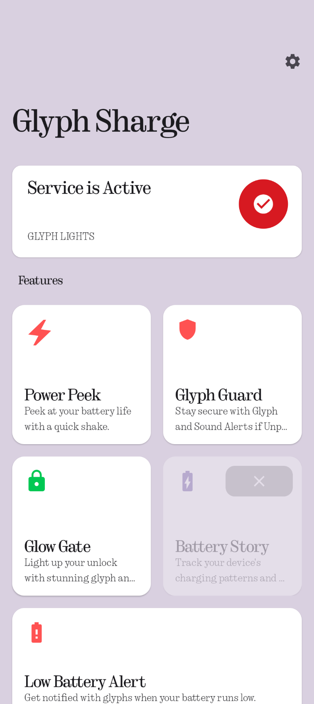
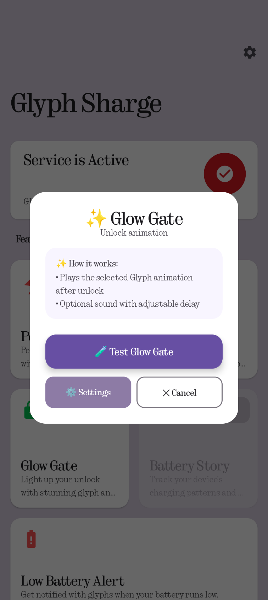
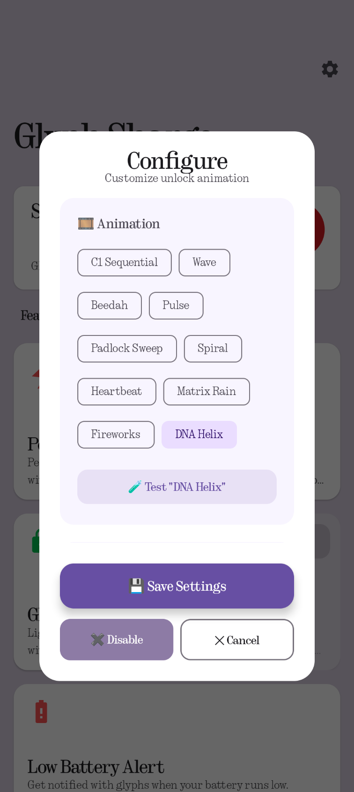
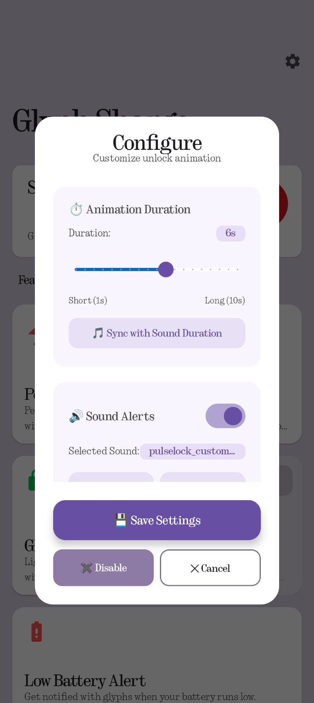
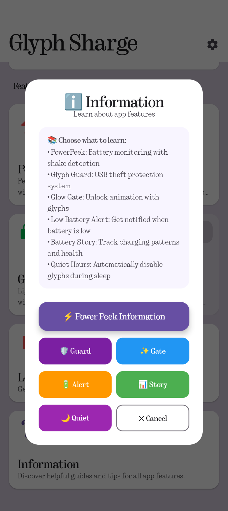
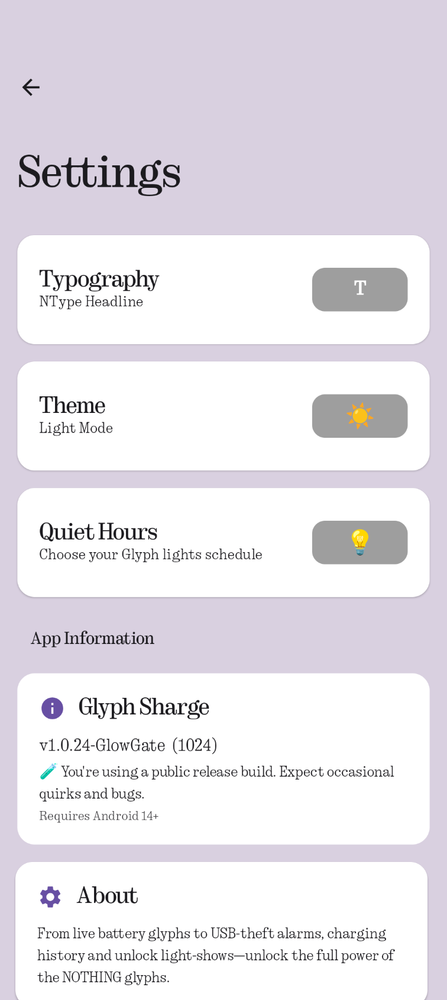
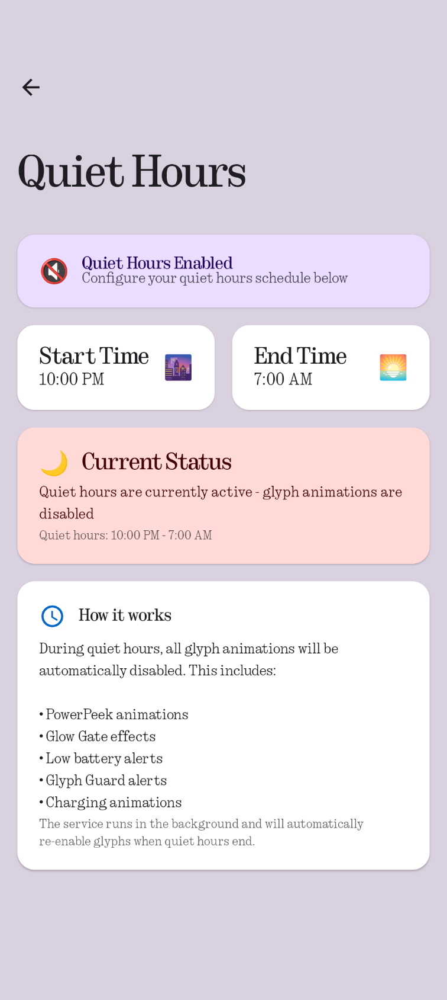

# ⚡ Glyph Sharge

> 🔐 **Note**: Glyph Sharge uses an **official Nothing API key**, so **debug mode is not required** for any glyph functionality.

---

**Power. Protect. Personalize. All through light.**

---

## 🔌 What is Glyph Sharge?

Glyph Sharge is your ultimate control center for the Nothing Glyph Interface. With a modern Material You design and deep system integration, it lets you manage power, enhance security, and personalize your experience — all through your phone’s glowing glyphs.

Whether you're checking charge levels or activating security features, Glyph Sharge turns your Nothing Phone into a functional and expressive light interface.

---

## 🌟 Key Features

### ⚡ Power Peek

*Battery monitoring with shake detection*

* Shake your device to view battery percentage
* Works even when the screen is off
* Customizable sensitivity and display duration
* Visualize your phone’s battery status through smooth glyph patterns

---

### 🛡️ Glyph Guard

*USB theft protection system*

* Protects your device from USB-based attacks
* Alerts you if your device is unplugged unexpectedly
* Designed for public charging safety
* Timed glyph lighting with optional sound alerts

---

### ✨ Glow Gate

*Unlock animation with glyphs*

* Animates the glyphs when unlocking your device
* Adds a unique visual flair to your lock screen
* Can be enabled or disabled in settings

---

### 🔋 Low Battery Alert

*Get notified when battery is low*

* Alerts when your battery drops below a defined level
* Helps you avoid unexpected shutdowns
* Customizable alert threshold

---

### 📊 Battery Story

*Track charging patterns and health*

* Visualizes your charging sessions and battery health
* Helps you understand your charging habits
* Provides insights for battery longevity

---

### 🌙 Quiet Hours

*Automatically disable glyphs during sleep*

* Schedules times when glyphs are disabled
* Prevents unwanted notifications and lights at night
* Customizable start and end times

---

### 🎛 Glyph Service Control

Take full control of the Glyph Interface with start, stop, and configuration access.
All service management, simplified.

---

## 🎨 Design & Personalization

Modern looks meet functional comfort:

* **Material 3 UI**
  Follows Google's latest design system for cards, colors, and interactions.

* **Theme Control**
  Toggle between light and dark modes and apply your preferred font.

---

## 📦 Compatible Devices

Glyph Sharge works on the following Nothing Phone models:

* ✅ **Phone (1)**
* ✅ **Phone (2)**
* ✅ **Phone (2a / 2a+)**
* ✅ **Phone (3a / 3a Pro)**
* ❌ **Phone (3)** – *Not supported*

---

## 🧩 Simple & Powerful

* **No Clutter**
  Organized card-based layout for quick, distraction-free use.

* **Touch Optimized**
  Large controls make everything easy to interact with.

---

Glyph Sharge empowers you to control your Nothing Phone’s light features like never before — with tools for charge visualization, security, and customization. A beautiful fusion of light and utility.

**⚙️ Manage it. Secure it. Light it up your way.**

---

## 📱 Screenshots

|  |  |  |  |
| ----------------------- | ----------------------- | ----------------------- | ----------------------- |
|  |  |  | 

---
